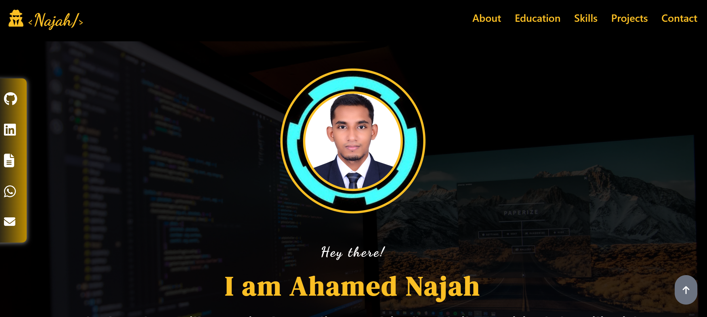

[](https://app.netlify.com/sites/celadon-gnome-5f7f0f/deploys)
# My Portfolio



## Overview

This is my personal portfolio website built using **React**, **Vite**, and **Tailwind CSS**. The portfolio showcases my skills, projects, and professional experiences. It includes a home page, an about section, projects, and a contact form.

## Features

- **Responsive Design:** The portfolio is fully responsive and works seamlessly on all devices, including desktops, tablets, and mobile phones.
- **Modern UI/UX:** Designed with a focus on clean, modern aesthetics using Tailwind CSS for styling.
- **Fast Loading:** The application is optimized for performance using Vite as the build tool.
- **Interactive Components:** The portfolio includes animations and interactive components to engage visitors.

## Tech Stack

- **React:** JavaScript library for building user interfaces.
- **Vite:** Next-generation frontend tooling. It's fast, lightweight, and comes with out-of-the-box support for React.
- **Tailwind CSS:** Utility-first CSS framework for rapid UI development.

## Installation

To run the project locally, follow these steps:

1. **Clone the repository:**
   ```bash
   git clone https://github.com/your-username/your-portfolio-repo.git
   
2. **Navigate to the project directory:**

        cd your-portfolio-repo
  
3. **Install dependencies:**

        npm install
  
4. **Start the development server:**

        npm run dev
     
5. **Build for production:**

        npm run build
