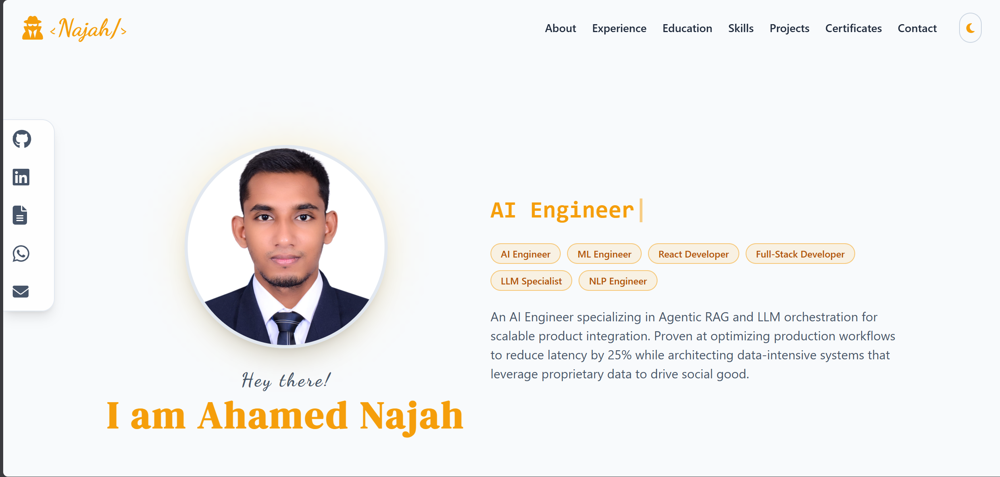

# 🚀 Modern React Portfolio

[](https://app.netlify.com/sites/celadon-gnome-5f7f0f/deploys)
[](https://reactjs.org/)
[](https://vitejs.dev/)
[](https://tailwindcss.com/)
[](https://www.framer.com/motion/)

A sleek, modern, and highly responsive personal portfolio website built with **React**, **Vite**, and **Tailwind CSS**. Designed to showcase professional experience, projects, and skills with a focus on smooth user experience and interactive elements.



## 🆕 Recent Updates (v2.0)

-   **Complete UI Overhaul:** Transitioned from legacy CSS backgrounds to a clean, professional, utility-first design using Tailwind CSS.
-   **Glassmorphism & Modern Aesthetics:** Replaced rotating borders and heavy graphics with sleek glassmorphic containers, subtle shadows, and a polished minimalist layout.
-   **Advanced Scroll Animations:** Implemented `framer-motion` `whileInView` hooks across all major sections (About, Education, Skills, Projects, Contact) for fluid, scroll-triggered reveals.
-   **Robust Theme Toggling:** Fixed and fortified the dark/light mode infrastructure via React Context and `localStorage` to ensure flawless theme persistence across the entire application and DOM.
-   **Responsive Spacing Polish:** Perfected alignment, padding, and layout overflow handling on both desktop and mobile viewports.

## ✨ Key Features

-   **🌓 Dynamic Theme Switching:** Seamlessly toggle between Light and Dark modes for a customized viewing experience.
-   **📱 Fully Responsive:** Optimized for all screen sizes—from high-resolution desktops to mobile devices.
-   **🎬 Smooth Animations:** Powered by **Framer Motion** for elegant transitions and interactive component behavior.
-   **🛠️ Tech-Focused Sections:** 
    -   **Interactive Projects:** Showcase work with detailed descriptions and live links.
    -   **Skills Matrix:** Visual representation of technical expertise.
    -   **Work & Education:** Structured timelines of professional and academic growth.
    -   **Certification Gallery:** Display earned credentials and achievements.
-   **📧 Integrated Contact Form:** Functional messaging system powered by **Formspree**.
-   **⚡ High Performance:** Built on **Vite** for lightning-fast load times and optimized production builds.

## 🛠️ Tech Stack

-   **Frontend:** [React](https://reactjs.org/) (Hooks, Context API)
-   **Build Tool:** [Vite](https://vitejs.dev/)
-   **Styling:** [Tailwind CSS](https://tailwindcss.com/)
-   **Animations:** [Framer Motion](https://www.framer.com/motion/)
-   **Icons:** [FontAwesome](https://fontawesome.com/)
-   **Forms:** [Formspree](https://formspree.io/)
-   **Deployment:** Netlify & GitHub Pages

## 🚀 Getting Started

Follow these instructions to set up the project locally on your machine.

### Prerequisites

-   [Node.js](https://nodejs.org/en/) (v14 or later recommended)
-   [npm](https://www.npmjs.com/) or [yarn](https://yarnpkg.com/)

### Installation

1.  **Clone the repository:**
    ```bash
    git clone https://github.com/najahaja/YoungDevInterns-ReactJS-Portfolio.git
    cd YoungDevInterns-ReactJS-Portfolio
    ```

2.  **Install dependencies:**
    ```bash
    npm install
    ```

3.  **Start the development server:**
    ```bash
    npm run dev
    ```

4.  **Open your browser:**
    Navigate to `http://localhost:5173` to see the site running.

## 📁 Project Structure

```text
src/
├── assets/             # Images, icons, and global styles
├── components/         # Reusable UI components
│   ├── BodySections/   # Individual sections (About, Projects, etc.)
│   └── Navbar.jsx      # Navigation logic
├── context/            # React Context (Theme management)
├── pages/              # Main page layouts
├── App.jsx             # Main application entry point
└── main.jsx            # React DOM rendering
```

## 📦 Deployment

### GitHub Pages
The project includes a `gh-pages` script for easy deployment:
```bash
npm run deploy
```

### Netlify
Connected via continuous deployment (CI/CD) to the main branch. Any push to `main` will automatically trigger a build and update the live site.

## 🤝 Contributing

Contributions are always welcome! If you'd like to improve the portfolio:
1.  Fork the Project.
2.  Create your Feature Branch (`git checkout -b feature/AmazingFeature`).
3.  Commit your Changes (`git commit -m 'Add some AmazingFeature'`).
4.  Push to the Branch (`git push origin feature/AmazingFeature`).
5.  Open a Pull Request.

## 📄 License

Distributed under the MIT License. See `LICENSE` for more information (if applicable).

## 📩 Contact

**Ahamed Najah** - [@najahaja](https://github.com/najahaja)

